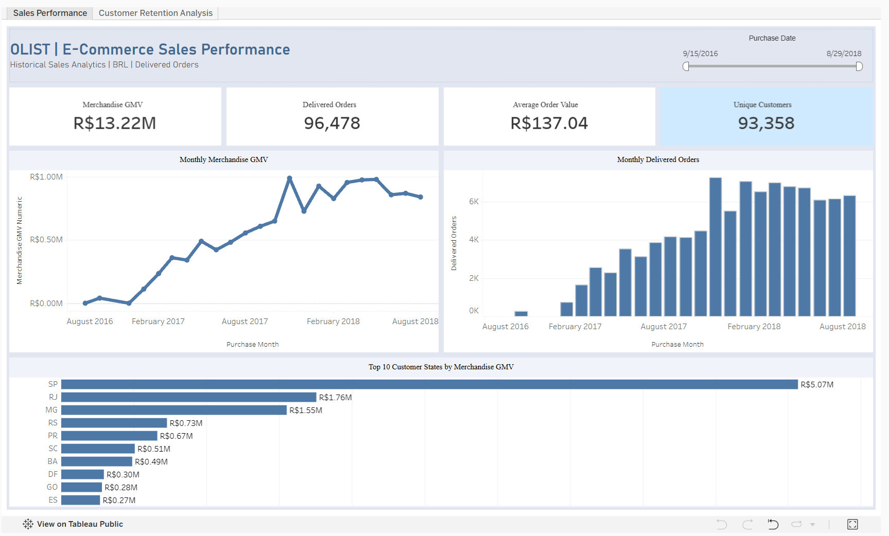
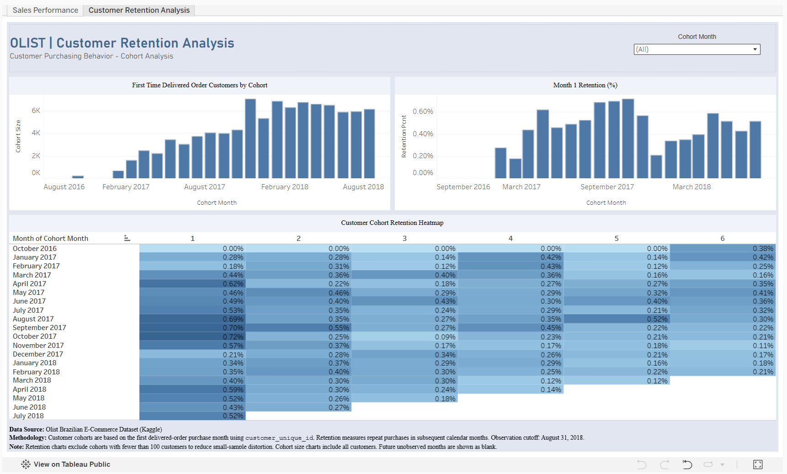

# E-Commerce Sales & Customer Retention Analytics

An end-to-end data analytics project exploring sales performance, customer purchasing behavior, and retention using the Brazilian Olist E-Commerce dataset.

The analysis uses **Python, SQL, and Tableau** to turn raw transaction data into business insights and interactive dashboards.

## Interactive Dashboard

**[View the Tableau Dashboard](https://public.tableau.com/views/Olist_Ecommerce_Analytics_17915120406030/CustomerRetentionAnalysis)**

The Tableau workbook includes two dashboards:

- **Sales Performance** — Merchandise GMV, delivered orders, average order value, unique customers, monthly trends, and sales by customer state.
- **Customer Retention Analysis** — New customer cohorts, Month 1 retention, and a monthly cohort retention heatmap.

## Dashboard Preview

### Sales Performance

### Customer Retention Analysis

## Business Questions

This project aims to answer:

1. How much merchandise GMV was generated from delivered orders?
2. How did sales and order volume change over time?
3. Which customer states contributed the most sales?
4. How often did customers return after their first purchase?

## Key Findings

### 1. Sales Performance

- **R$13.22M** in merchandise GMV across **96,478 delivered orders**.
- **R$137.04** average order value.
- **93,358 unique customers** associated with delivered orders.

Merchandise GMV represents the value of purchased items, excluding freight. It should not be interpreted as net revenue or profit.

### 2. Sales Trends

November 2017 recorded **7,289 delivered orders**, the highest monthly order volume in the analysis.

This period would be worth exploring further to understand whether promotional activity or seasonal demand contributed to the increase.

### 3. Geographic Performance

**São Paulo (SP)** was the largest contributor to merchandise GMV, generating approximately **R$5.07M**.

The geographic breakdown helps identify where purchasing activity is concentrated and supports further regional performance analysis.

### 4. Customer Retention

Repeat purchasing in the following calendar month was relatively uncommon across the observed customer cohorts.

- The **January 2018 cohort** contained **6,842 customers**, with **0.34% Month 1 retention**.
- Among 2017 cohorts with at least 100 customers, **October 2017** recorded the highest Month 1 retention at **0.72%**.

These findings describe purchasing patterns but do not establish why customers did or did not return.

## Tools & Workflow

| Tool | Purpose |
|---|---|
| Python (Pandas) | Data exploration, cleaning, and validation |
| SQL (DuckDB) | KPI calculations, sales analysis, and cohort analysis |
| Tableau | Interactive dashboards and visual storytelling |
| Google Colab | Python notebook development |

**Analysis workflow:**

1. Explored the dataset and checked data quality.
2. Calculated merchandise GMV, average order value, order volume, and customer metrics using SQL.
3. Built monthly customer cohorts using each customer's first delivered order.
4. Created Tableau dashboards to visualize sales performance and customer retention.

## Business Recommendations

Based on the analysis, three areas are worth further investigation:

- **Customer retention:** Explore post-purchase engagement and opportunities to encourage repeat purchases.
- **Regional performance:** Compare customer behavior across states to identify potential growth opportunities.
- **Sales seasonality:** Investigate promotional and seasonal factors behind changes in monthly order volume.

These are areas for further analysis rather than proven explanations for the observed results.

## Methodology & Limitations

- Sales KPIs are based on delivered orders.
- Merchandise GMV excludes freight and does not represent net revenue.
- Average order value is calculated as merchandise GMV divided by delivered orders.
- Customer identification uses `customer_unique_id`.
- Cohorts are based on customers' first delivered orders.
- Retention measures subsequent purchases in calendar months after the first delivered order.
- The observation cutoff is **August 31, 2018**.
- Retention comparison charts exclude cohorts with fewer than 100 customers to reduce small-sample distortion. The cohort size chart includes all cohorts.
- Future months outside the observation window are left blank rather than treated as zero retention.
- The dataset does not establish the causes of customer purchasing or retention behavior.

## Dataset

**Brazilian E-Commerce Public Dataset by Olist**

[Dataset on Kaggle](https://www.kaggle.com/datasets/olistbr/brazilian-ecommerce)

This project was created for learning and portfolio purposes using publicly available historical data.
